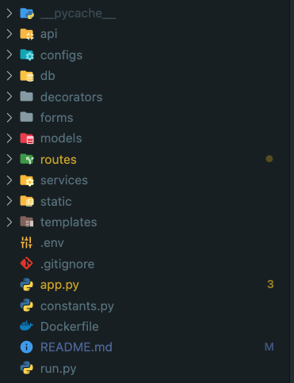
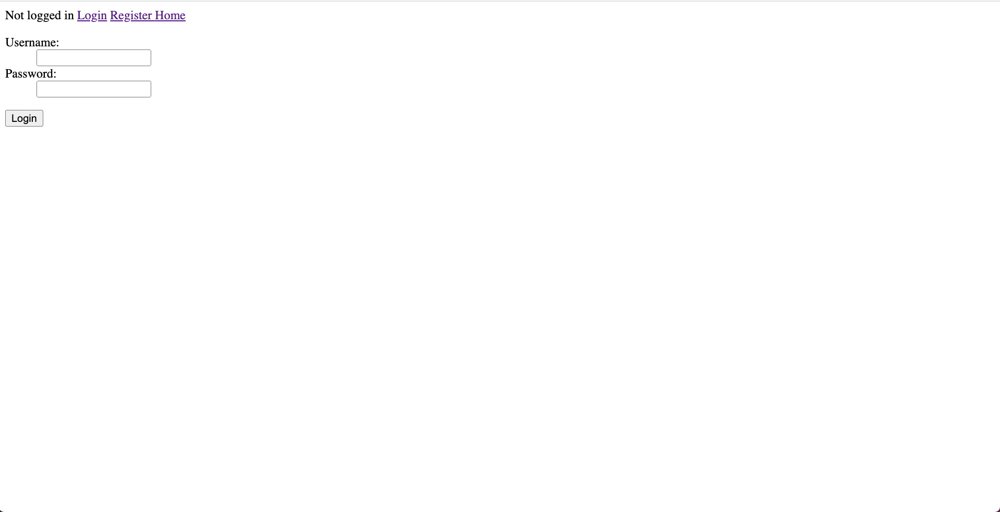
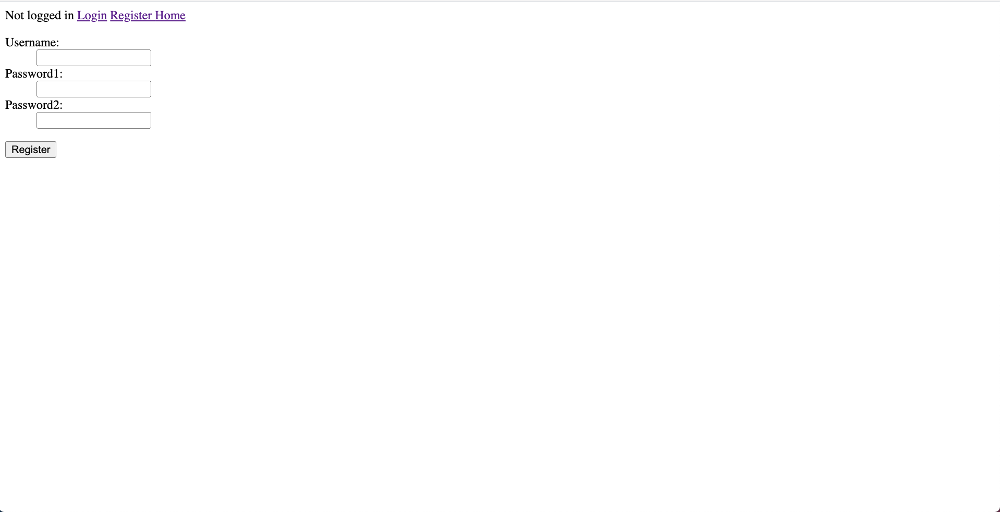
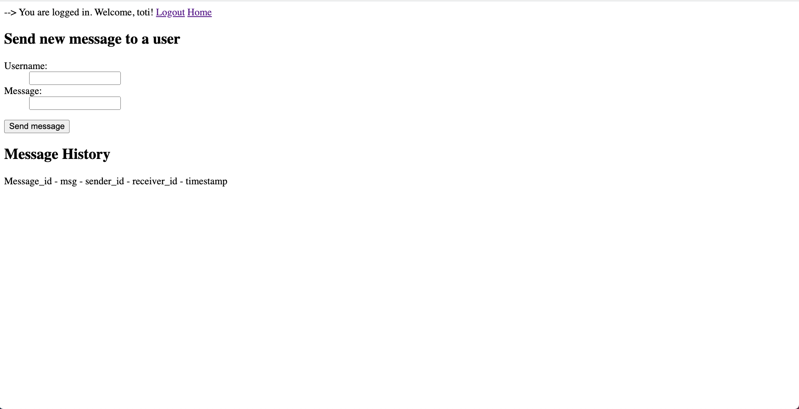

# Assignment2 - Software Security - Messaging application

# Part 2A - implementation

## Security considerations made during development

A simple messaging app was created to account for potential security issues.
Things considered during the development phase:

- Cross-site scripting attacks
- Cross-site request forgery
- SQL injection
- Insecure design

# Part 2B - Documentation

## Overview

A messaging was developed as an extensions of the given login server.
As a user, one can authenticate by logging in to an existing account or register a new account.
Input validations are defined and exceptions raised when given faulty input. The user receives a message corresponding to the exception thrown.
Once a user has authenticated its access level is changed as features such as sending a message to a particular username now become available. As well as a messaging history. The user is has the ability to access a messaging session it has created with another user, both view previous messages sent and received, as well as send new ones.

A pure flask implementation was used to create the messaging service.

### Endpoints

#### User interaction

- /
- /login
- /register
- /logout

#### API

- /api/messages
- /api/messages/<message_id>
- /api/new

### Project structure

## Features

### User related features

- Login
- Register
- Logout

### Message related features

- Retrieve a messaging history
- Send a new message to another user by username
- Enter a messaging session with another user by user_id

## Instructions to demo app

### Env setup

- pip install virtualenv
- virtualenv <env_name>
- source <env_name>/bin/activate

### Fire up flask

- flask run

### Expected ouput/view

###

###

###

## Technical details on the implementation

- Flask
- Authentication
- Database
- Design choices
- Project structure

### Flask

Lightweight web framework compared to other frameworks as Django. Easy and flexible for a project of this size. Rich with specific libraries as well as pyhton libraries.

### Authentication

We apply the middleware flask_login to our flask app. The flask_login library handles the authentication part of our application. Functions such as login_user(), logout_user() and login_required.
This way we can easily add the decorator login_required to each endpoint we wish the user to be authenticated to use. This is applied to all endpoints except the /login and /register of course, as the users are not logged in. The middleware is applied in the app.py file, while used in the /routes directory in both message_routes.py and user_routes.py. An idea of splitting up the user_routes.py file into two different files: user_routes.py and auth_routes.py was thought of. However, abondened as all the routes in the user_routes.py are strictly authentication routes. This would make sense in a larger scale application where other user features were to be implemented, as we wish to seperate the authentication to exist as its own entity.

### Database

As this is an extension to the login-server created by Anya. We continued using sqlite as our main and only database. A singleton design pattern was applied to the database instantiation, only allowing a single instance of the database to exist. The database can be found in /db directory. Prepared statements were applied to protect our database from potential SQL injections. Sensitive information stored in the database was encrypted/hashed, as was done for storing the password of the user.

### Design choices

Following the seperation of concerns pattern. Splitting the application into presentation layer, business layer, and resource access layer. Presentation layer are the /routes and /api directories essentially, while those /routes and /api directories utilize the /service directory for data resource access and manipulation. In practice, the business logic is not included as it felt redundant for such a small size project. The overall seperation of components into their own directories simplies the development phase of the project as well as increases security as things are not mashed all into one file, rather distributed into their own environments and accidently accessing a global variable is not an issue.

We introduced both a config and a dotenv file. The config makes it easier to maintain control over the application as the configurations are all defined in a single file easily accessable and viewable. The configurations are then applied in the app.py file. The dotenv file ensures that our flask secret for session usage is not accessible to an intruder as the dotenv file is only deployed in production and not on git for example. This at least mitigates or reduces the chance of someone getting access to the secret.

### Project structure

### Questions

1. Threat model – who might attack the application? What can an attacker do? What damage could be done (in terms of confidentiality, integrity, availability)? Are there limits to what an attacker can do? Are there limits to what we can sensibly protect against?
2. What are the main attack vectors for the application?
3. What should we do (or what have you done) to protect against attacks?
4. What is the access control model?
5. How can you know that you security is good enough? (traceability)

### Answers to questions

1.

The password strength of the application is not particularly good. It requires a password of length 8. No special characters or numbers are required to increase the strength of the password. Also, there is no mechanism that protects against someone hammering our application with requests of passwords and simply guessing the password until it finds it. This is something that should be implemented in forms of logging and notifying the actual user the fact that someone is attempting this, or more importantly the we the authors of the application should timeout/block incoming requests to prevent such attempts.

In terms of confidentiality
We ensured that when messages are fetched that both users are either senders or receivers of the messages. However, were the messages to leak, the messages in our application are not encrypted, they are stored in plain text in both the database and responses. This could be mitidaged with cryptographic solutions. Introduction to either a symmetric or assymetric encryption solution would sufficient. Either both users share a single key (symmetric) to encrypt and decrypt their messages, or alternatively each have their own set of public key and private key to encrypt and decrypt. The users could encrypt their messages using the others public key that is ok for everyone to know, where only the private key corresponding to the public key used in the encryption can decrypt the message. This could be added such that the messages in the database are encrypted as well as the

Even if the entruder would gain access to our user instances from our database. The passwords are hashed and the attacker would be left unrendered from using the password to sign in to our application.

In terms of integrity
We have ensured that users only get access to data that is connected to them in someway or another by foreign key or such. In addition prepared statements were applied to each sql statement written in our application, preventing the attacker from inserting or removing sensitive information from our database.

In terms of Availability
As mentioned previously, we have not implemented any mechanism to prevent the attacker from performing a distributed denial-of-service (DDoS) attack. This is has been covered above. However, this would render our users unable to access their messages as our application would surely crash from the load of the attack.

2.

- Weak credentials
- Brute force
- Distributed Denial of Service (DDoS)

Weak Credentials
As mentioned the weak credentials, the password strength could be increased and even introducing other service that check the inputted password into a "most common" password bank. Also, two-factor authentication would reduce the risk of an intruder logging into your account.

Brute Force
As mentioned, the application is not protected against scripting, in the way that one could write a script guessing passwords infinitely, as the application does not log or make sure that it is not being brute forced.

Distributed Denial of Service (DDoS)
The application makes no attempt to counter such an attack.

3. Above, potential threats has been mentioned and recommendations have been made. Now, for what has been done to protect the application from attacks.

- Prepared statements
- CSRF
- XSS

For sql injections, prepared statements were applied to each sql statement in the code
CSRF was applied to the application and a csrf token requirement for each form in the templates directory.
XSS was prevented in terms of escape() functions, all user input, messages and usernames were passed through an escape() function which ensures no scripts of any sort can be embedded in the input.
Also added a polciy, content-security-policy "default-src 'self'" in the policies directory. As this polciy disallows scripts protecting it against XSS.

4. For a simple application as such, only two roles were introduced. Logged in or not logged in. Simply because the features of the application it was not necessary to add other roles.

5. You can test your application with different tools that attack your application with known attacks and tries to breach your security and find vulnerabilities. OWASP ZAP is an example of such a tool.

# Sources used

## Prevent Cross site scripting in django

- https://brightsec.com/blog/cross-site-scirpting-prevention/#python

## Good documentation on how to secure your program

- https://smirnov-am.github.io/securing-flask-web-applications/

## Traceability and Cybersecurity

- https://www.internetsociety.org/resources/doc/2020/traceability-and-cybersecurity-experts-workshop-series-on-encryption-in-india/
